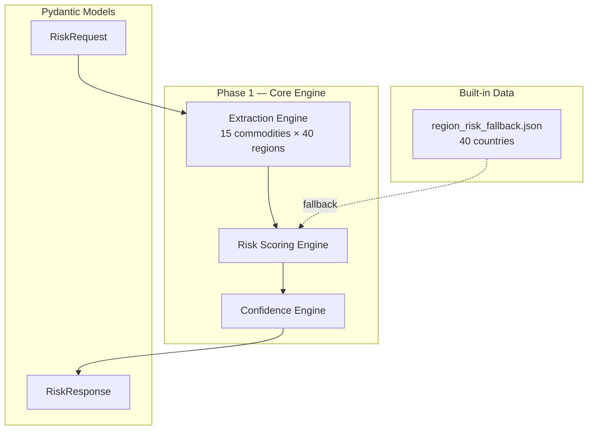

# Phase 1: Core Extraction & Scoring Engine

## 1. Overview
Phase 1 establishes the foundation of the Deforestation Risk Scorer — the **extraction engine** and **scoring engine**. These components work entirely offline with no external API dependencies, making them testable and reliable from day one.

## 2. Setup Guide
**Prerequisites:** Python 3.10+, pip
```bash
git clone <repo-url>
cd Deforest
python -m venv venv
venv\Scripts\activate
pip install -r requirements.txt
copy .env.example .env

# Run Server
uvicorn app.main:app --reload
```

## 3. Architecture 


## 4. What Was Built
### Entity Extraction Engine (`app/services/extraction.py`)
Detects 15 primary deforestation-linked commodities and 40 risk regions using keyword and fuzzy alias matching in memory.

### Scoring Engine (`app/utils/scoring.py`)
Outputs a 0-100 `risk_score` by calculating:
`For each (commodity, region) pair: pair_score = commodity_weight × region_risk × 100` -> Weighted average.
Outputs a 0-100 `confidence_score` counting data supply.

### Pydantic Validation (`app/models/schema.py`)
All inputs and outputs strictly typed, ensuring frontend compatibility.

## 5. Data Dictionary
**Commodity Weights**
- Palm Oil (0.95), Beef / Cattle (0.92), Soy (0.90), Timber (0.85), Charcoal (0.82), Cocoa (0.80), Leather (0.80), Pulp & Paper (0.78), Rubber (0.75), Mining Minerals (0.72), Shrimp (0.70), Coffee (0.65), Sugarcane (0.55), Maize (0.45), Rice (0.40)

**Region Risk Tiers**
- **🔴 Critical (≥0.85):** Brazil, Indonesia, DR Congo, Malaysia, Paraguay, Bolivia. 
- **🟠 High (0.70–0.84):** Côte d'Ivoire, Colombia, Papua New Guinea, Peru, Myanmar, Ghana, Cambodia, Laos, Argentina, Nigeria, Cameroon, Ecuador, Honduras, Guatemala.
- **🟡 Moderate (0.50–0.69):** Madagascar, Vietnam, Liberia, Republic of Congo, Mexico, Sierra Leone, Central African Republic, Thailand, Tanzania, India, Mozambique, Venezuela, Philippines, Guyana, Suriname.
- **🟢 Lower (<0.50):** China, Chile, Costa Rica, Uruguay, South Africa.
