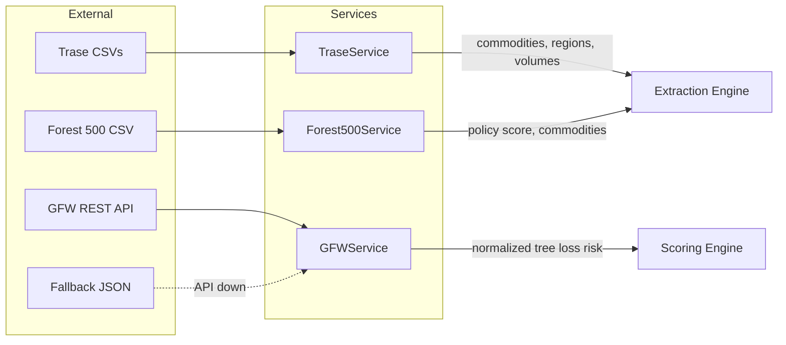

# Phase 2: Data Integrations — Trase, Forest 500, GFW

## 1. Overview
Phase 2 connects the scoring engine to **real data sources**. Three services were built, each loading data from a different source and exposing it through a consistent search/query interface.

| Service | Source | Data Type | Matching |
|---------|--------|-----------|----------|
| **TraseService** | Trase CSV files | Supply chain trade flows | Fuzzy company name |
| **Forest500Service** | Forest 500 CSV | Corporate policy rankings | Fuzzy company name |
| **GFWService** | GFW REST API | Tree cover loss by country | ISO country code |

## 2. Setup

### Environment Variables
Add to your `.env` (optional — services degrade gracefully without keys):
```env
GFW_API_KEY=your_gfw_api_key_here
```

### Download Data Files
See [`data/README.md`](../data/README.md) for step-by-step download instructions for Trase and Forest 500 CSVs. Place them in:
```
data/trase/*.csv
data/forest500/*.csv
```

## 3. Architecture



## 4. Services Detail

### Trase Service (`app/services/trase_service.py`)
- Loads **all CSV files** from `data/trase/` into a unified pandas DataFrame
- Normalizes column names (lowercase, underscores)
- Fuzzy matches company names across exporter/importer/trader columns
- Extracts: commodities, regions, trade volumes, deforestation indicators
- Returns structured results with match status

### Forest 500 Service (`app/services/forest500_service.py`)
- Loads CSV from `data/forest500/`
- Fuzzy matches company names
- Extracts: overall policy score (0-100), commodity exposure, category scores (governance, transparency, etc.)
- Policy score feeds into the scoring engine's Forest 500 adjustment

### GFW Service (`app/services/gfw_service.py`)
- Queries GFW Data API with SQL for tree cover loss by year per country
- Normalizes loss against Brazil benchmark (2.5M ha/year = risk 1.0)
- 1-hour in-memory cache to minimize API calls
- Automatic fallback to `region_risk_fallback.json` when API fails or no key
- Async HTTP via `httpx`

## 5. Testing

```bash
# Test Trase (requires CSVs in data/trase/)
python -c "from app.services.trase_service import TraseService; ts = TraseService(); ts.load(); print(ts.search('Cargill'))"

# Test Forest 500 (requires CSV in data/forest500/)
python -c "from app.services.forest500_service import Forest500Service; fs = Forest500Service(); fs.load(); print(fs.search('Unilever'))"

# Test GFW fallback (no API key needed)
python -c "
import asyncio
from app.services.gfw_service import GFWService
gs = GFWService()
result = asyncio.run(gs.get_tree_loss('BRA'))
print(result)
"
```
