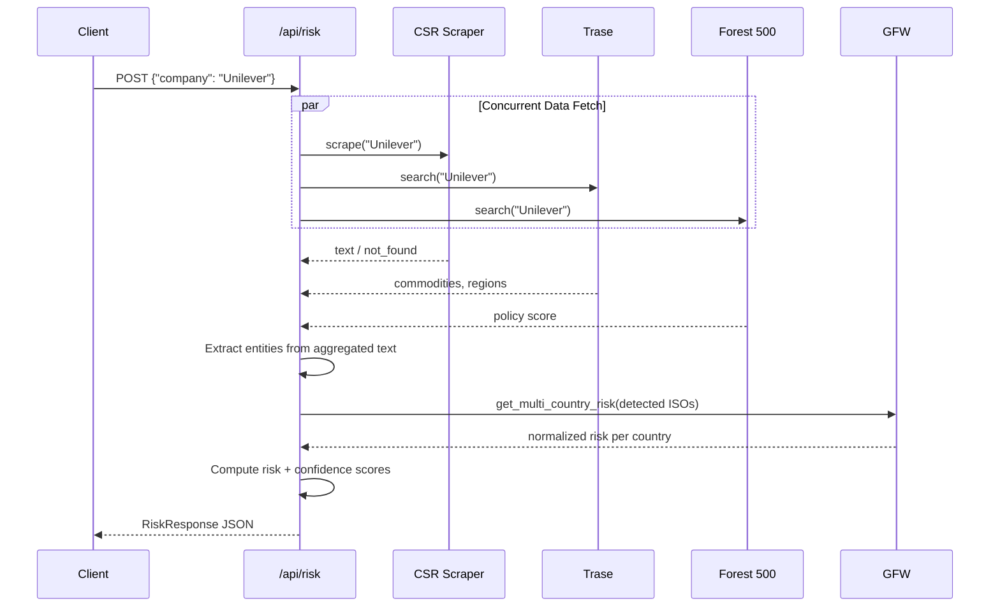

# Phase 3: CSR Scraper and Risk API Endpoint

## 1. Overview
Phase 3 completes the entire backend. The `/api/risk` endpoint now works **end-to-end**, orchestrating all 4 data sources concurrently and returning a comprehensive risk assessment.

## 2. What Was Built

### CSR Scraper (`app/services/scraper.py`)
- Generates candidate sustainability page URLs from company name (e.g., `unilever.com/sustainability`, `/esg`, `/csr`)
- Fetches via **Scrapingdog API** (JavaScript-rendered) with fallback to **direct HTTP**
- Extracts clean text via BeautifulSoup (strips scripts, navs, footers)
- Relevance filter: requires ≥3 deforestation keywords to accept a page

### Risk Orchestrator (`app/routes/risk.py`)
- `POST /api/risk` — main endpoint accepting `{"company": "Unilever"}`
- `GET /api/risk/{company}` — convenience GET endpoint
- Runs all 4 sources **concurrently** via `asyncio.gather`:
  1. CSR scraper → text for entity extraction
  2. Trase → commodities, regions, volumes
  3. Forest 500 → policy score, commodity exposure
  4. GFW → tree cover loss risk per detected region
- Aggregates text → extraction → scoring → response
- Handles partial failures gracefully

### Updated Main App (`app/main.py`)
- Lifespan events load Trase/Forest 500 CSVs into memory on startup
- Risk router registered
- Health check now shows real service statuses

## 3. API Reference

### `POST /api/risk`
```bash
curl -X POST http://localhost:8000/api/risk \
  -H "Content-Type: application/json" \
  -d '{"company": "Unilever"}'
```

**Request Body:**
```json
{ "company": "Unilever" }
```

**Response Schema:**
| Field | Type | Description |
|-------|------|-------------|
| `company` | string | Company name analyzed |
| `risk_score` | float | 0–100 risk score |
| `risk_level` | string | critical / high / moderate / low / minimal |
| `confidence_score` | float | 0–100 confidence score |
| `confidence_level` | string | high / moderate / low / very_low |
| `commodities` | array | Detected commodities with weights |
| `regions` | array | Detected regions with risk tiers |
| `breakdown` | array | Commodity × Region risk matrix |
| `sources` | array | Per-source status and data |
| `flags` | object | Disclosure quality flags |
| `summary` | string | Human-readable assessment |

### `GET /api/risk/{company}`
```bash
curl http://localhost:8000/api/risk/Cargill
```

### `GET /health`
```bash
curl http://localhost:8000/health
```

## 4. Request Flow



## 5. Setup

Add to `.env` (optional — both degrade gracefully):
```env
SCRAPINGDOG_API_KEY=your_key_here
GFW_API_KEY=your_key_here
```

## 6. Testing
```bash
# Start server
uvicorn app.main:app --reload

# Test endpoints
curl -X POST http://localhost:8000/api/risk -H "Content-Type: application/json" -d "{\"company\":\"Unilever\"}"
curl http://localhost:8000/api/risk/Cargill
curl http://localhost:8000/api/risk/JBS
curl http://localhost:8000/health
```
